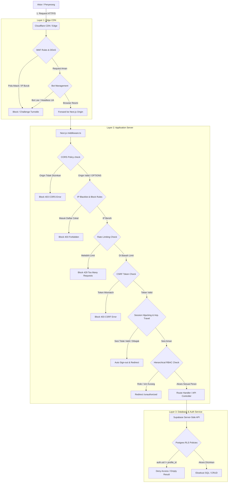
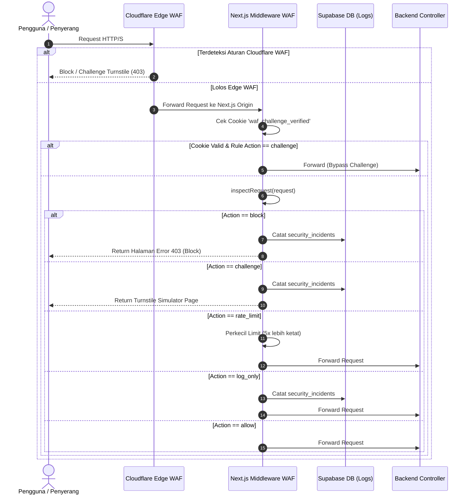

# RestoBook Security Architecture & Production Hardening Guide

Dokumen ini memaparkan arsitektur keamanan menyeluruh, alur proteksi request, detail mitigasi kerentanan OWASP, kontrol akses, serta panduan konfigurasi Cloudflare CDN/Edge untuk aplikasi **RestoBook** (Next.js & Supabase).

---

## 1. Arsitektur Keamanan & Alur Request (Edge-to-DB)

Sistem RestoBook menerapkan prinsip **Defense in Depth** (keamanan berlapis), di mana setiap layer (Edge/CDN, Application Server, Backend/DB) melakukan validasi dan penyaringan secara independen.



---

## 2. Implementasi CORS (Cross-Origin Resource Sharing)
Penerapan CORS di RestoBook diatur secara dinamis di [cors.ts](file:///c:/Users/rakba/Documents/Restoran/restobook/src/lib/cors.ts) dan diintegrasikan ke [middleware.ts](file:///c:/Users/rakba/Documents/Restoran/restobook/src/middleware.ts):

*   **Pembedaan Environment:**
    *   **Development:** Mengizinkan `localhost`, `127.0.0.1`, dan `capacitor://localhost` (untuk aplikasi mobile Capacitor Android/iOS).
    *   **Production:** Membatasi akses *hanya* pada domain resmi (`https://restobook.com`, `https://www.restobook.com`).
*   **Blokir Wildcard Berbahaya:** Wildcard (`*`) **dilarang keras** apabila `Access-Control-Allow-Credentials` diaktifkan karena browser akan memblokir request demi keamanan. Kami menyetel header `Access-Control-Allow-Origin` dengan origin pengirim yang valid setelah melewati proses whitelist.
*   **Pembatasan Method & Header:** Hanya mengizinkan method (`GET, POST, PUT, DELETE, OPTIONS`) dan header yang diperlukan (`Authorization`, `Content-Type`, `X-CSRF-Token`, dll.).
*   **Preflight Caching:** Preflight request (`OPTIONS`) dijawab langsung dengan status `204 No Content` di tingkat middleware untuk mengurangi beban controller, dengan header `Access-Control-Max-Age` disetel ke 24 jam (`86400` detik).

---

## 3. RBAC (Role-Based Access Control) & Route Protection
Matriks peran di [rbac.ts](file:///c:/Users/rakba/Documents/Restoran/restobook/src/lib/rbac.ts) membagi hak akses ke dalam 4 peran utama dengan relasi **Hirarki Tingkat Akses**:
`superadmin (Level 4) > admin (Level 3) > cashier (Level 2) > customer (Level 1)`

*   **Implementasi Middleware:**
    Jika rute yang dituju adalah rute sensitif `/admin/*`, `/cashier/*`, atau `/customer/*`, middleware akan mengekstrak peran pengguna (`UserRole`) dari Supabase dan melakukan pengecekan `hasMinimumRole(userRole, requiredRole)`.
    *   Pengguna dengan peran `admin` atau `superadmin` secara otomatis diizinkan mengakses halaman kasir (`/cashier/*`) karena level hirarki mereka lebih tinggi.
    *   Pengguna dengan peran rendah (misal: `customer` mencoba mengakses `/admin`) akan langsung dialihkan ke `/unauthorized`.
*   **Supabase Row-Level Security (RLS):**
    Di sisi database, RLS membatasi baris data agar user biasa hanya bisa melihat data miliknya sendiri. Contoh kebijakan RLS untuk tabel `orders`:
    ```sql
    CREATE POLICY "User can only view their own orders" 
    ON public.orders FOR SELECT 
    USING (auth.uid() = user_id OR EXISTS (
        SELECT 1 FROM public.profiles WHERE user_id = auth.uid() AND role IN ('admin', 'superadmin', 'cashier')
    ));
    ```

---

## 4. Sistem Rate Limiting & Anti Brute-Force
Next.js Middleware menggunakan cache memori in-memory dan database Supabase untuk menyaring ancaman brute-force dan DDoS:

*   **Multi-Layer Rate Limiting:**
    Setiap request API diperiksa melalui 4 lapisan kunci rate limit:
    1.  **IP Rate Limit:** Membatasi request per IP address unik.
    2.  **Fingerprint Rate Limit:** Mengidentifikasi mesin/perangkat unik menggunakan hashing sidik jari gabungan (`deviceUuid`, `userAgent`, `timezone`, dll.) untuk mendeteksi penyerang yang mengubah IP-nya secara dinamis menggunakan VPN/Proxy.
    3.  **Subnet Rate Limit (`/24` atau `/64`):** Mendeteksi penyerangan terdistribusi dari satu ISP/subnet yang sama.
    4.  **ASN Rate Limit:** Mendeteksi serangan masif dari botnet cloud provider tertentu.
*   **Pengurangan Limit Dinamis untuk VPN/Proxy:**
    Jika middleware mendeteksi request berasal dari VPN atau Proxy, batas toleransi (rate limit threshold) akan otomatis **diperketat 3 kali lipat** untuk mencegah credential stuffing.
*   **DDoS Leveling & Delay Execution:**
    *   **Level 1-2 (Anomali Ringan):** Response sengaja ditunda (delay) selama 2-5 detik sebelum dieksekusi untuk menghabiskan resource bot penyerang (Tarpitting).
    *   **Level 3-4 (Banjir Request Masif):** IP penyerang otomatis didaftarkan ke tabel `security_ip_rules` dengan jenis `blacklist` selama 1-24 jam dan langsung diblokir di awal middleware.

---

## 5. OWASP Top 10 Mitigations di RestoBook

| Kerentanan | Metode Mitigasi di RestoBook |
| :--- | :--- |
| **SQL Injection** | Supabase menggunakan ORM PostgREST dengan *parameterized queries* bawaan. Penulisan query SQL mentah dilarang keras. Tambahan fungsi deteksi dini `hasSQLInjection` di tingkat utilitas keamanan. |
| **Cross-Site Scripting (XSS)** | Penggunaan fungsi `sanitizeString` untuk membuang karakter HTML tag dan `purifyHTML` untuk membersihkan konten dinamis dari skrip berbahaya (misal: `<script>`, `onload=`, `javascript:`). |
| **CSRF (Cross-Site Request Forgery)** | Sistem validasi token ganda (*Double Submit Cookie*). Setiap request mutasi (`POST, PUT, DELETE`) diwajibkan menyertakan header `X-CSRF-Token` yang cocok dengan cookie `csrf-token` yang bertanda `secure` dan `sameSite: strict`. |
| **IDOR / IDOR** | Seluruh tabel Supabase dilindungi oleh **Row Level Security (RLS)**. Data tidak dapat diambil hanya dengan mengubah UUID di URL; Postgres akan memastikan `auth.uid() = user_id` pemilik baris data tersebut. |
| **SSRF (Server-Side Request Forgery)** | Fungsi `hasSSRF` memindai dan memblokir input URL yang mengarah ke IP lokal/private loopback (`localhost`, `127.0.0.1`, subnet `192.168.*`, `10.*`, `172.*`, dan IP metadata AWS/GCP `169.254.169.254`). |
| **Broken Authentication** | Menerapkan Session binding berdasarkan IP/Negara/Browser. Jika terdeteksi perubahan negara secara instan (Impossible Travel < 3 jam) atau perubahan browser mendadak, sesi langsung dicabut (*revoked*) demi keamanan. |
| **Sensitive Data Exposure** | Password tidak pernah disimpan mentah, melainkan di-hash menggunakan algoritma enkripsi standar industri (Bcrypt/Scrypt) di Supabase Auth. Seluruh komunikasi wajib menggunakan TLS/HTTPS (diarahkan otomatis via redirect 301). |
| **File Upload Vulnerability** | Validasi berkas di `validateFileUpload` meliputi: anti-double-extension, scanning isi berkas untuk *embedded script*, pembatasan ukuran maks, dan pencocokan **Magic Numbers** binary (JPG: `FFD8FF`, PNG: `89504E47...`, PDF: `25504446`). |
| **Clickjacking & Path Traversal** | Header `X-Frame-Options: DENY` dipasang di semua rute halaman. Regex `hasPathTraversal` memeriksa dan memblokir karakter direktori traversal seperti `../` dan `%2e%2e%2f` pada rute Next.js. |

---

## 6. Implementasi Web Application Firewall (WAF)

Aplikasi RestoBook dilengkapi dengan **Virtual WAF (Web Application Firewall)** di tingkat aplikasi ([waf.ts](file:///c:/Users/rakba/Documents/Restoran/restobook/src/lib/waf.ts) & [middleware.ts](file:///c:/Users/rakba/Documents/Restoran/restobook/src/middleware.ts)) serta konfigurasi rekomendasi **WAF di Layer Edge (Cloudflare)**.

### A. Alur Kerja WAF (Request Flow)
1. **Request Masuk:** Request HTTP/S diterima oleh CDN (Cloudflare) / Server Next.js.
2. **Edge Inspection:** Cloudflare WAF memeriksa signature IP, User-Agent, dan payload sesuai aturan yang disetel.
3. **Application Middleware Inspection:**
   - Middleware memeriksa cookie `waf_challenge_verified`. Jika ada dan valid (usia < 30 menit), verifikasi tantangan dilewati.
   - Panggilan [inspectRequest](file:///c:/Users/rakba/Documents/Restoran/restobook/src/lib/waf.ts) menganalisis parameter URL, headers, dan cookies terhadap pola serangan (regex).
4. **WAF Action Resolution:**
   - **`block`:** Request langsung diputus, insiden dicatat di tabel `security_incidents`, dan response halaman error 403 Forbidden / JSON dikembalikan.
   - **`challenge`:** Request diintersepsi dengan halaman verifikasi "Saya Bukan Bot" (Turnstile Simulator). Setelah lolos verifikasi, cookie `waf_challenge_verified` disetel selama 30 menit dan halaman dimuat ulang.
   - **`log_only`:** Aktivitas mencurigakan dicatat di database, namun request tetap diteruskan.
   - **`rate_limit`:** Menurunkan batas ambang batas (rate limit threshold) sebesar 5x lipat untuk request berikutnya dari IP/sidik jari bersangkutan.
5. **Diteruskan ke Backend:** Request yang lolos inspeksi diteruskan ke Route Handler atau API Controller Next.js.



### B. Aturan Deteksi (Signature Rules)
Virtual WAF RestoBook memindai input terhadap ancaman keamanan utama:
- **SQL Injection (SQLi):** Mendeteksi pola query SQL seperti `UNION SELECT`, `INSERT INTO`, `OR 1=1`, dll.
- **Cross-Site Scripting (XSS):** Memblokir tag `<script>`, `javascript:`, inline event handlers (`onerror`, `onload`), dan manipulasi cookie/window.
- **Path Traversal & LFI/RFI:** Memindai rute direktori seperti `../`, `..\`, `/etc/passwd`, file konfigurasi sistem, dan IP metadata loopback `169.254.169.254`.
- **Command Injection:** Memblokir karakter pemisah perintah shell seperti `; cat`, `| bash`, `&& sh`, dan system commands.
- **SSRF (Server-Side Request Forgery):** Memblokir parameter URL yang mengarah ke internal host seperti `localhost`, `127.0.0.1`, IP range privat `192.168.x.x`, `10.x.x.x`, dll.
- **Probing & Path Enumeration:** Memblokir request ke path/berkas sensitif yang sering dipindai bot (`wp-admin`, `.env`, `.git`, `xmlrpc.php`, `phpinfo`, database dumps).
- **User-Agent Malicious:** Memblokir program pemindai kerentanan otomatis (`sqlmap`, `nikto`, `nmap`, `dirbuster`, dll.).

### C. Proteksi Manipulasi Parameter (Parameter Tampering Protection)
WAF memantau parameter sensitif secara ketat melalui fungsi [detectParameterManipulation](file:///c:/Users/rakba/Documents/Restoran/restobook/src/lib/waf.ts):
1. **Financial Parameters (`price`, `discount`, `total`, `dp_amount`, `grand_total`):** Wajib berupa nilai angka non-negatif (`/^[0-9]+(\.[0-9]+)?$/`). Karakter non-numerik atau nilai negatif akan langsung diblokir.
2. **Access Control Parameters (`role`, `privilege`):** Hanya mengizinkan nilai yang terdaftar dalam whitelist peran resmi (`customer`, `cashier`, `admin`, `superadmin`).
3. **Identity Parameters (`id`, `user_id`):** Wajib mengikuti format UUID v4 standar atau integer ID numerik. String pendek alfanumerik maks 24 karakter diizinkan jika bersih dari SQLi/XSS.

### D. Prinsip Defense in Depth
WAF bekerja sebagai **lapisan keamanan terluar** (first line of defense), namun **bukan pengganti validasi backend**. 
- WAF bertugas memotong request berbahaya dengan overhead minimal sebelum menyentuh logika komputasi berat.
- Validasi data tingkat lanjut (seperti pemeriksaan kecocokan harga menu dengan database asli pada *Price Tampering Protection* layer) dan kontrol akses berbasis *Row-Level Security (RLS)* di database tetap berjalan secara independen untuk memastikan keamanan maksimal meskipun WAF mengalami bypass.

---

## 7. Pengaturan Produksi Cloudflare CDN/Edge (Rekomendasi)

Untuk mengamankan aplikasi secara optimal, konfigurasi berikut wajib disetel pada dashboard Cloudflare:

### A. SSL/TLS Settings
*   **SSL/TLS Recommender:** Aktif (`On`).
*   **Encryption Mode:** **Full (Strict)**. Memastikan lalu lintas terenkripsi dari browser hingga ke origin Next.js secara ketat menggunakan sertifikat SSL valid.
*   **Always Use HTTPS:** Aktif (`On`).
*   **Minimum TLS Version:** **TLS 1.2** atau **TLS 1.3** (Rekomendasi).

### B. WAF Custom Rules (Aturan WAF Kustom)
Buat aturan kustom berikut di menu **Security > WAF > Custom Rules**:

1.  **Blokir Request Langsung ke Origin (Bypass Prevention):**
    *   *Expression:* `(http.request.uri.path contains "/api/" and not cf.client.port in {80 443})` atau gunakan custom header rahasia dari API Gateway.
    *   *Action:* Block.
2.  **Blokir User-Agent Mencurigakan / Alat Pentest:**
    *   *Expression:* `(http.user_agent contains "sqlmap" or http.user_agent contains "nikto" or http.user_agent contains "nmap" or http.user_agent contains "dirbuster" or http.user_agent contains "masscan")`
    *   *Action:* Block.
3.  **Tantangan Turnstile untuk Endpoint Sensitif dari Luar Indonesia:**
    *   *Expression:* `(http.request.uri.path in {"/api/auth/login" "/api/register" "/api/send-otp"} and ip.geoip.country ne "ID")`
    *   *Action:* Managed Challenge (Menampilkan Cloudflare Turnstile).

### C. Bot & DDoS Protection
*   **Bot Fight Mode:** Aktif (`On`). Menghentikan scraper otomatis dan headless browser berbahaya sebelum mencapai Next.js.
*   **HTTP DDoS Attack Protection:** Setel ke **High** sensitivity.
*   **Security Level:** **Medium** (Default untuk umum) atau **High** (Aktifkan saat terdeteksi upaya serangan brute-force masif).

---

## 8. Logging, Monitoring, & Incident Response (IR)

### A. Logging Struktur Keamanan
Tabel `security_logs` mencatat seluruh peristiwa keamanan di aplikasi. Parameter log terstruktur meliputi:
*   `activity`: Kategori aksi (`LOGIN_FAILED`, `RATE_LIMIT_EXCEEDED`, `CSRF_VIOLATION`, `PATH_TRAVERSAL`, `SUSPICIOUS_FILE_UPLOAD`).
*   `severity`: Tingkat urgensi (`low`, `medium`, `high`, `critical`).
*   `payload`: Menyimpan data konteks (tanpa informasi sensitif seperti password asli).

### B. Monitoring & Realtime Alerting
Sistem menggunakan Supabase Realtime Channel untuk mengirim notifikasi keamanan langsung ke Dashboard Admin.
*   **Dashboard Security:** Admin dapat melihat daftar insiden keamanan, subnet yang terblokir, serta log aktivitas IP secara langsung (*realtime*).
*   **Integrasi Webhook (Slack / Discord):** Disarankan menyetel cron job atau database trigger pada tabel `security_incidents` dengan keparahan `critical` untuk menembakkan Webhook notifikasi darurat ke tim DevOps.

### C. Incident Response (IR) Plan
Jika terjadi serangan keamanan aktif:
1.  **Aktifkan Mode Darurat (Emergency Mode):**
    Ubah kolom `emergency_mode` di tabel `security_settings` menjadi `true`. Ini akan memicu middleware untuk:
    *   Memperketat rate limits sebesar 10x lipat (`tightened_rate_limits = true`).
    *   Menutup pendaftaran akun baru (`block_new_registrations = true`).
    *   Menutup endpoint pengiriman OTP / reset password (`block_sensitive_endpoints = true`).
2.  **Pencekalan IP Cepat:**
    Daftarkan IP penyerang langsung ke tabel `security_ip_rules` melalui menu Admin untuk melakukan pemblokiran instan di tingkat middleware.
3.  **Pencekalan Subnet/ASN:**
    Gunakan tabel `security_subnet_blocks` untuk memblokir seluruh jangkauan IP penyerang secara kolektif.
